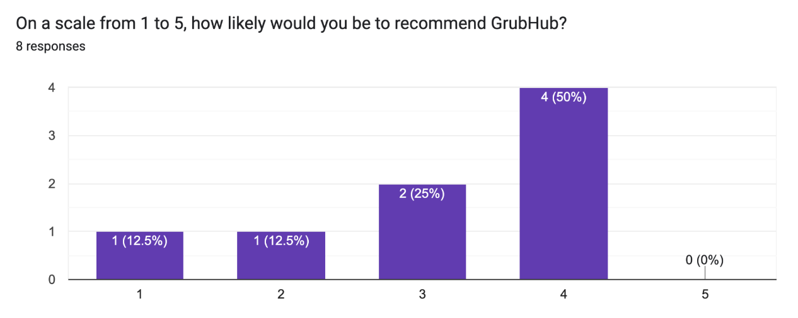
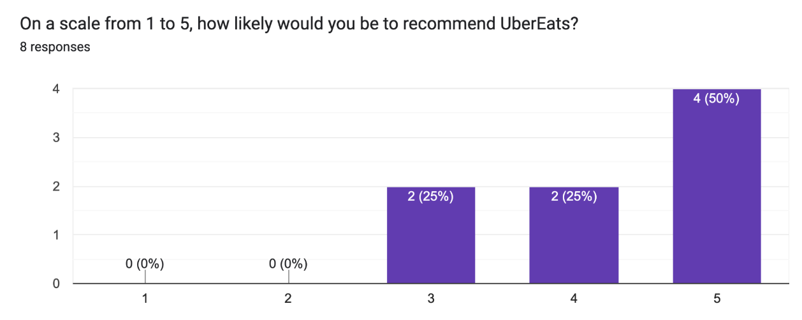
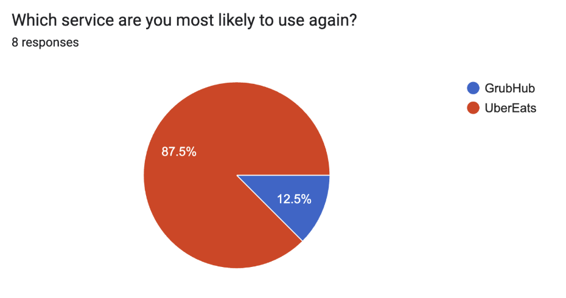

**CMSI 3700** Interaction Design, Fall 2023

# Usability Study Report

# GrubHub vs UberEats

Group Members:
- Makena Robison
- Ashley Buschhorn
- Tori Wei
- Troy Womack-Henderson

## Study Description
This study tested which food delivery service, GrubHub or UberEats, users liked more based on efficiency, errors, and satisfaction. We created three different tasks for the users to complete to test various UI and UX elements contained in both app.

### Task 1: Searching for a Sushi Restaurant open past 10 p.m. 
For the first task users were asked to find a Sushi Restaurant open past 10 p.m. This was designed to test the usability of the apps search and filter features. This also tested where users expected to see the hours of operation as UberEats houses it on the restaurant page whereas GrubHub houses it on a secondary page mapped to by a three-dot menu button.

### Task 2: Placing an Order at Benny's Tacos and Chicken Rotisserie
For this task users were asked to place an order to Benny’s Tacos and Chicken Rotisserie at 7101 W Manchester Ave, Los Angeles, CA 90045. Users were tasked with adding the three following items to the order: a California Burrito with Grilled Chicken, Grilled Steak Fajitas, and a Churro. Users were asked to check that the delivery address was the home address: 1 LMU Dr. Los Angeles, CA 90045. This task was designed to test the ordering system of each application

### Task 3: Add a new Saved Address in Account 
For this task users were asked to add a saved address to the logged in account. Users were asked to add address 12105 E Waterfront Dr, Los Angeles, CA 90094 to the account. This task tested the applications’ account design and edit capabilities.

## Study Results
### Demographic Results: ###

We studied eight different participants all of whom were 21 years old. Half of the participants live on-campus and the other half live off-campus. This is an important metric because GrubHub can be used for ordering ahead from on-campus restaurants. All participants attested to using a food delivery service in the past with UberEats being the most common.

### Task 1 Results: ###

_Efficiency: Time to complete task in seconds._

<table>
  <tr>
   <td>User
   </td>
   <td>GrubHub
   </td>
   <td>Uber
   </td>
  </tr>
  <tr>
   <td>1
   </td>
   <td>183 sec
   </td>
   <td>28 sec
   </td>
  </tr>
  <tr>
   <td>2
   </td>
   <td>137 sec
   </td>
   <td>99 sec
   </td>
  </tr>
  <tr>
   <td>3
   </td>
   <td>46 sec
   </td>
   <td>15 sec
   </td>
  </tr>
  <tr>
   <td>4
   </td>
   <td>46 sec
   </td>
   <td>13 sec
   </td>
  </tr>
  <tr>
   <td>5
   </td>
   <td>21 sec
   </td>
   <td>8 sec
   </td>
  </tr>
  <tr>
   <td>6
   </td>
   <td>174 sec
   </td>
   <td>67 sec
   </td>
  </tr>
  <tr>
   <td>7
   </td>
   <td>93 sec
   </td>
   <td>113 sec
   </td>
  </tr>
  <tr>
   <td>8
   </td>
   <td>65 sec
   </td>
   <td>34 sec
   </td>
  </tr>
  <tr>
   <td>Average Time
   </td>
   <td>95.625 sec
   </td>
   <td>47.125 sec
   </td>
  </tr>
</table>

_Errors: Actions taken by user that were unexpected or unintended._

<table>
  <tr>
   <td>User
   </td>
   <td>Error (Grubhub)
   </td>
   <td>Error (Uber)
   </td>
  </tr>
  <tr>
   <td>1
   </td>
   <td>Scrolled and clicked many different options before finding the three-dot menu that contains the hours
   </td>
   <td>n/a
   </td>
  </tr>
  <tr>
   <td>2
   </td>
   <td>n/a
   </td>
   <td>n/a
   </td>
  </tr>
  <tr>
   <td>3
   </td>
   <td>Clicked through the wrong filtering buttons and scrolled past open option, had to re-search
   </td>
   <td>n/a
   </td>
  </tr>
  <tr>
   <td>4
   </td>
   <td>Pressed sort, scrolled past open option
   </td>
   <td>n/a
   </td>
  </tr>
  <tr>
   <td>5
   </td>
   <td>Looked in sort menu 
   </td>
   <td>n/a
   </td>
  </tr>
  <tr>
   <td>6
   </td>
   <td>n/a
   </td>
   <td>Didn’t hit the save button when filtering time for sushi restaurants and had to redo step.
   </td>
  </tr>
  <tr>
   <td>7
   </td>
   <td>Choose AM instead of PM for filtering time to locate an open restaurant. Got the wrong results from that, but fixed it.
   </td>
   <td>n/a
   </td>
  </tr>
  <tr>
   <td>8
   </td>
   <td>Scrolled past open option
   </td>
   <td>n/a
   </td>
  </tr>
  <tr>
   <td>Total of Users with Errors
   </td>
   <td>6
   </td>
   <td>1
   </td>
  </tr>
</table>

_Satisfaction: How easy was it for users to use the product/are they likely to use the product again_

| GrubHub      | UberEats |
| ----------- | ----------- |
|       |       |
| Average: 3 | Average: 4.625       |
|     |          |
| Average: 4.75  | Average: 5       |
|     |          |
| Average: 3.75  | Average: 4.625       |
|     |          |
| Average: 2.875  | Average: 4.75       |

### Task 2 Results: ###

_Efficiency: Time to complete task in seconds._

<table>
  <tr>
   <td>User
   </td>
   <td>Time (Grubhub)
   </td>
   <td>Time (Uber)
   </td>
  </tr>
  <tr>
   <td>1
   </td>
   <td>66 sec
   </td>
   <td>63 sec
   </td>
  </tr>
  <tr>
   <td>2
   </td>
   <td>81 sec
   </td>
   <td>77 sec
   </td>
  </tr>
  <tr>
   <td>3
   </td>
   <td>128 sec
   </td>
   <td>55 sec
   </td>
  </tr>
  <tr>
   <td>4
   </td>
   <td>73 sec
   </td>
   <td>52 sec
   </td>
  </tr>
  <tr>
   <td>5
   </td>
   <td>74 sec
   </td>
   <td>46 sec
   </td>
  </tr>
  <tr>
   <td>6
   </td>
   <td>45 sec
   </td>
   <td>53 sec
   </td>
  </tr>
  <tr>
   <td>7
   </td>
   <td>77 sec
   </td>
   <td>31 sec
   </td>
  </tr>
  <tr>
   <td>8
   </td>
   <td>83 sec
   </td>
   <td>64 sec
   </td>
  </tr>
  <tr>
   <td>Average Time
   </td>
   <td>78.375
   </td>
   <td>55.125
   </td>
  </tr>
</table>

_Errors: Actions taken by user that were unexpected or unintended._

<table>
  <tr>
   <td>User
   </td>
   <td>Error (Grubhub)
   </td>
   <td>Error (Uber)
   </td>
  </tr>
  <tr>
   <td>1
   </td>
   <td>n/a
   </td>
   <td>n/a
   </td>
  </tr>
  <tr>
   <td>2
   </td>
   <td>n/a
   </td>
   <td>n/a
   </td>
  </tr>
  <tr>
   <td>3
   </td>
   <td>Couldn’t find benny’s at first
   </td>
   <td>n/a
   </td>
  </tr>
  <tr>
   <td>4
   </td>
   <td>n/a
   </td>
   <td>n/a
   </td>
  </tr>
  <tr>
   <td>5
   </td>
   <td>n/a
   </td>
   <td>n/a
   </td>
  </tr>
  <tr>
   <td>6
   </td>
   <td>n/a
   </td>
   <td>n/a
   </td>
  </tr>
  <tr>
   <td>7
   </td>
   <td>n/a
   </td>
   <td>Forgot to add the churro to the order before confirming delivery. Had to go back to add to order.
   </td>
  </tr>
  <tr>
   <td>8
   </td>
   <td>n/a
   </td>
   <td>n/a
   </td>
  </tr>
  <tr>
   <td>Total of Users with Errors
   </td>
   <td>1
   </td>
   <td>1
   </td>
  </tr>
</table>

_Satisfaction: How easy was it for users to use the product/are they likely to use the product again_
| GrubHub      | UberEats |
| ----------- | ----------- |
|       |       |
| Average: 4.25 | Average: 5       |
|     |          |
| Average: 4.375  | Average: 4.875       |
|     |          |
| Average: 4.875  | Average: 4.875       |
|     |          |
| Average: 4.625  | Average: 4.75       |
|     |          |
| Average: 4.625  | Average: 5       |
|     |          |
| Average: 2.75  | Average: 4.75       |

### Task 3 Results: ###

_Efficiency: Time to complete task in seconds._

<table>
  <tr>
   <td>User
   </td>
   <td>Time (Grubhub)
   </td>
   <td>Time (Uber)
   </td>
  </tr>
  <tr>
   <td>1
   </td>
   <td>37 sec
   </td>
   <td>137 sec
   </td>
  </tr>
  <tr>
   <td>2
   </td>
   <td>68 sec
   </td>
   <td>144 sec
   </td>
  </tr>
  <tr>
   <td>3
   </td>
   <td>51 sec
   </td>
   <td>75 sec
   </td>
  </tr>
  <tr>
   <td>4
   </td>
   <td>49 sec
   </td>
   <td>85 sec
   </td>
  </tr>
  <tr>
   <td>5
   </td>
   <td>38 sec
   </td>
   <td>27 sec
   </td>
  </tr>
  <tr>
   <td>6
   </td>
   <td>53 sec
   </td>
   <td>119 sec
   </td>
  </tr>
  <tr>
   <td>7
   </td>
   <td>68 sec
   </td>
   <td>104 sec
   </td>
  </tr>
  <tr>
   <td>8
   </td>
   <td>47 sec
   </td>
   <td>90 sec
   </td>
  </tr>
  <tr>
   <td>Average Time
   </td>
   <td>51.375
   </td>
   <td>97.625
   </td>
  </tr>
</table>

_Errors: Actions taken by user that were unexpected or unintended._

<table>
  <tr>
   <td>User
   </td>
   <td>Error (Grubhub)
   </td>
   <td>Error (Uber)
   </td>
  </tr>
  <tr>
   <td>1
   </td>
   <td>n/a
   </td>
   <td>Did not know that profile circle in top right was a button. Went to address search bar on home page to try to change saved address, but only completed a recent address.
   </td>
  </tr>
  <tr>
   <td>2
   </td>
   <td>n/a
   </td>
   <td>n/a
   </td>
  </tr>
  <tr>
   <td>3
   </td>
   <td>n/a
   </td>
   <td>Changed address through order form, not profile
   </td>
  </tr>
  <tr>
   <td>4
   </td>
   <td>n/a
   </td>
   <td>Changed address through order form, not profile
   </td>
  </tr>
  <tr>
   <td>5
   </td>
   <td>n/a
   </td>
   <td>n/a
   </td>
  </tr>
  <tr>
   <td>6
   </td>
   <td>n/a
   </td>
   <td>Couldn’t find the profile at first, but first navigated to the “Deliver Now” button in the top left to change the saved addresses.
   </td>
  </tr>
  <tr>
   <td>7
   </td>
   <td>n/a
   </td>
   <td>n/a
   </td>
  </tr>
  <tr>
   <td>8
   </td>
   <td>n/a
   </td>
   <td>Only changed recent address
   </td>
  </tr>
  <tr>
   <td>Total of Users with Errors
   </td>
   <td>0
   </td>
   <td>5
   </td>
  </tr>
</table>

_Satisfaction: How easy was it for users to use the product/are they likely to use the product again_
| GrubHub      | UberEats |
| ----------- | ----------- |
|       |       |
| Average: 4.625 | Average: 4       |
|     |          |
| Average: 4.625  | Average: 3.5       |

## Heuristic Evaluation

### Evaluating Interaction Design Principles/Theories by Task

#### Task 1

When users were using Grub Hub to locate a sushi restaurant open past 10 pm, the majority of the users expressed confusion with the “Sort” feature in the app, as it gives users the assumption that they can sort based on time, but the app only gives the option to sort based on recommended, fastest {delivery time}, price: low to high, price: high to low, rating, and {resturant} distance. There is no indication that clearly states that out of all restaurants available to the users have the ability to sort them based on the restaurant’s hours. By lacking a clear indication that the “Sort” feature would also host restaurant hours as a filtering factor to consider for useability, users assumed the “Sort” feature would meet their desire to ease the process of narrowing down their options of sushi restaurants open past 10 pm. This results in the user having to search “sushi” in the search bar or select the sushi icon in the “quick food option” bar on the opening page and then having to check the time for each sushi restaurant listed. As for the hour's information, only the indicator “Open Now” or “Closed” is displayed for the user’s knowledge of the restaurant’s hours. To see the complete hours for the restaurant, the user has to navigate to the (i) icon (indicating information) in the top right corner of the screen to see a list of all restaurant information, including time. So from the point of entering the app, the user has to take three total steps, if they don’t encounter any errors.

When users were using Uber Eats to locate a sushi restaurant open past 10 pm, there was less confusion amongst users in locating time for restaurants based on the study, however, the restaurants will show “Open Until {closing time}”, which GrubHub didn’t contain on their restaurant storefront pages. With this element of displaying efficient store information on the storefront page prevents users from having to take additional steps to find a single piece of information. However, if the user wanted to locate the complete store hours to see if they are open past 10 pm, then they would have to navigate to the three dots icon button and then select the “Store info” button, and then they will be able to see the “Open Until {closing time}” statement in a selection dropdown format, and then they are finally able to see the complete hours for the restaurant listed. So from the point of opening the app, the user has to either search on the homepage “sushi” or navigate to the “Browse” icon on the bottom navigation bar, search “sushi” or select the sushi category and once the user navigates to their selected restaurant page it takes an additional three steps to find the information they are looking for, which is to see if that particular restaurant is open past 10 pm. It takes an additional two steps to find the needed restaurant hours information in Uber Eats compared to GrubHub. With all these additional steps the app lacks overall efficiency of use for the user with a total of five steps for the user to locate a single piece of information to order food. There were no shortcuts for the user to have to find the restaurant hours desired and as a result, had to be subject to trial and error with all the additional steps and a longer time to complete the task.

#### Task 2
| GrubHub                  | UberEats                  |
| ------------------------  | ------------------------  |
|   |   |

When ordering a specific menu item, UberEats does a better job implementing “Aesthetic and Minimalist Design” which explains why users completed Task 2 (Ordering items from Benny’s Tacos) faster through UberEats.

On both apps, once a user selects a menu item, they must make choices for specific categories, For GrubHub, there are dropdowns for each category. The user must tap each category to view the options, as the menus are collapsed by default. With UberEats, all the categories and their corresponding options are displayed at once. GrubHub users will have to press more buttons to place an order, making this an inferior implementation of minimalist design. UberEats implements clear bolding of categories and margin color in between each category to help the user differentiate between their choices.

Another instance where UberEats has a more minimalist design is through the labeling of required choices. GrubHub labels each category, both for required and optional choices. It is displayed as a subtitle, like “Select one (Required),” and the text is red when required. The text turns to the default grey once a required selection has been made. When a choice is required on UberEats, the app provides a label that has an “X” and says “Required” on the right side of the choice. The “X” becomes a checkmark and the text becomes green once the selection has been made. There are some bugs in the app, where the first label sometimes turns back to grey, rather than green. The green still improves the overall aesthetic of the app and provides a bit of gratification for the user. Using color and symbols can also help users save time, as they are not reading a full subtitle.

#### Task 3

When looking to change the default address, Grubhub implements the provide signposts and cues principle significantly more than UberEats leading to a significantly lower rate of errors on GrubHub. 

In the design of Grubhub, the tab for the account management page is clearly indicated with both a profile icon and the label “account”. After navigating to that page, the user is presented with a list of menus, one labeled “Addresses” in which you can add a new saved address. All of these labels and signifiers give the user a clear direction through the app, allowing them to complete Task 3 in an efficient and error free way. 

In the UberEats design, there is a significant lack of signposts and cues. On the homepage, similar to Grubhub, there is an account tab labeled with a profile icon and the word “account” Once you get to this menu though, there is a listed menu with various options, but none of them relate to address or location. To find the address menu, the users has to click on an unlabeled circle that looks like it is meant for a profile picture. This proved to be very unintuitive and many of our users couldn’t find this menu at all. There’s nothing that indicates that would be a menu in which the user could edit the address. A small addition of a pencil symbol or plus sign that indicates editing capabilities would possibly decrease the number of errors on the user side. 

### Prioritization of Metrics
Our subset of metrics ranked by importance are: (1) Efficiency, (2) Errors, and (3) Satisfaction. Majority  of our users already stated their preferred food delivery app was UberEats, so we valued Efficiency and Errors to eliminate any possible bias in our satisfaction survey. Effienency was our top ranked priority due to the nature of food delivery apps. People use food delivery apps for their convenience, as it can be quicker than placing a phone/in-person order at a restaurant, so using the app should be a quick experience for users. Measuring errors was another important aspect of this study. Exploring the impact and severity of the errors allowed us to see how user mistakes affected (or did not affect) efficiency and satisfaction. For example, in Task 3, UberEats was less effecient, but by understanding the errors, we realize that UberEats still provide alternate pathways to accomplishing a task. For example, even if users were not able to change the address in their profile, they could do so in the order form. With this method, the general task of changing the address is still accomplished Our last metric, satisfaction, was important but not as crucial. As stated above, many already were satisfied UberEats, so we did not weight this as heavy in our final Usability Decision. However, measuring satisfaction allowed us to see where user preference matched the actual results.

## Usability Decision
Although GrubHub performed better on the final task, UberEats far outranked GrubHub for tasks 1 and 2. With this in mind, we have determined that UberEats is more usable than GrubHub. We made this decision based mainly on efficiency and error study results. In Tasks 1 and 2 UberEats was far more efficient and less error prone than GrubHub. These metrics were more important to us because a majority of our participants, five out of eight, stated UberEats at the beginning of the survey as their most used food delivery service leading to them being more satisfied with UberEats. Because of this, we relied heavily on efficiency and error data. We would be remiss not to point out that GrubHub far exceeded UberEats in efficiency, error, and satisfaction on Task 3. However, we found through both errors and participant feedback that UberEats still has proper address efficiency; it is just contained within the ordering system, not the account. Therefore we are confident that UberEats is a more usable application than GrubHub. As you can see participant results support this conclusion.

#### Participants Usability Decision
| GrubHub      | UberEats |
| ----------- | ----------- |
|       |       |
| Average: 3.125 | Average: 4.25       |

## Statement of Work
Our entire group worked together to create the instructions and methodology of the tasks and subsequent survey. We all seperately conducted user tests. We then analyzed the data together and divided up the remaining work. We came back together to write the final Usability Decision. Below is a detailed list of how we divided the work of the final report.
- Ashley: Study Results
- Troy: Task 1 Heuristic Evaluation
- Tori: Task 2 Heuristic Evaluation
- Makena: Task 3 Heuristic Evaluation 

