**CMSI 370** Interaction Design, Fall 2016

# Group Chat Usability Study

- Anson Adams
- Anthony Escobar
- Harris Lummis
- Allen Vartanian
- Andres Lazo

## Study Description

The systems we compared are the desktop versions of team collaboration applications, HipChat and Slack. These applications were chosen because of their similar functionalities and purpose, as well as our anticipation that a large number of users would be unfamiliar with them, rendering both viable for learnability testing.

Chosen tasks:

- Task 1: Create a new channel/room called "usability survey" and set its purpose/topic to "best survey ever"
- Task 2: Add someone to the current chat by their email address.
- Task 3: Change the current user's profile picture/avatar to an existing photo.

Chosen Metrics:

- Metric 1 - Learnability: For each task, we give a short explanation of the task the participant should accomplish. We restrict our explanation to general verbal tasks, such as "create a new group chat," barring all technical details. Then, we ask the participant to complete the requested task using the application and verbalize their thought process as they progress. We time how long the task takes to complete successfully and record audio so as to understand how the participant percieves their interactions with the application. We note how many errors and what were made in the attempt to complete each task.
- Metric 2 - Efficiency: First, the participant fully learns how to complete each of the three tasks proficiently and demonstrates their ability to complete the tasks free of errors. Then, we ask the participant to complete each task as quickly as possible without error, timing how long each individual task takes to complete successfully.
- Metric 3 - Satisfaction: After each survey is conducted, we ask study participants to rate their overall level of satisfaction in using each application on a level from 1 (no satisfaction or enjoyment) to 10 (high level of satisfaction and enjoyment).

## Study Results

### Data Table

For data collection, each of the three metrics are measured for each participant for both applications. The data sheet is organized by tasks on the x axis, further split into metrics and the different measurements. Trials using Slack are on the upper half while trials using HipChat are on the lower half. Data is collected from 9 participants, totaling 9 surveys for each application.

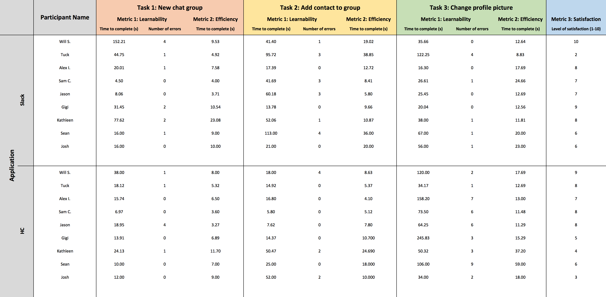

### Data Analysis

Each graph displays the measurement of a certain metric. For metric 1, Learnability, both mean time to learn task and mean number of errors are graphed. For metric 2, Efficiency, mean time to complete task is graphed. For metric 3, Satisfaction, mean satisfaction level is graphed. For each graph pertaining to metric 1 and 2, the data is split between the three tasks.

A one-tailed t-test is performed for each task for each metric measurement with hypothesis: (mean of Slack measurements) – (mean of HipChat measurements) = 0. In order of most statistically significant to least statistically significant:

 p-value | Measurement 
---|---
0.003|# errors to learn task 3
0.025|Time to learn task 2
0.030|Time to learn task 3
0.065|Time to complete task 2
0.088|Time to learn task 1
0.147|# errors to learn task 2
0.148|Time to complete task 1
0.167|Time to complete task 3
0.240|# errors to learn task 1
0.333|Satisfaction

Therefore, if defining a p-value under 0.05 as statistically significant, then only the difference between Slack and HipChat in the number of errors to learn task 3, time to learn task 2, and time to learn task 3 can be considered statistically significant.

Learning to add a person to a current chat by email in HipChat is faster than in Slack by a factor of 2.23. Learning to change the users profile picture to an existing picture in Slack is faster than in HipChat by a factor of 2.18. Learning to create a new chat group is faster in HipChat by a factor of 2.35, but the difference is not statistically significant. 

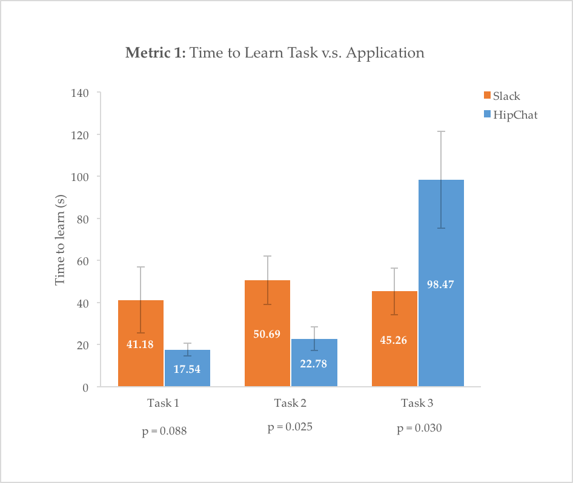

There is no statistically significant difference in the participants' number of errors while learning to create a new chat group or learning to add a person to a current chat. However, the difference between Slack and HipChat in the participants' number of errors while learning to add a new profile picture is extremely statistically significant. Slack is 4.87 times faster.

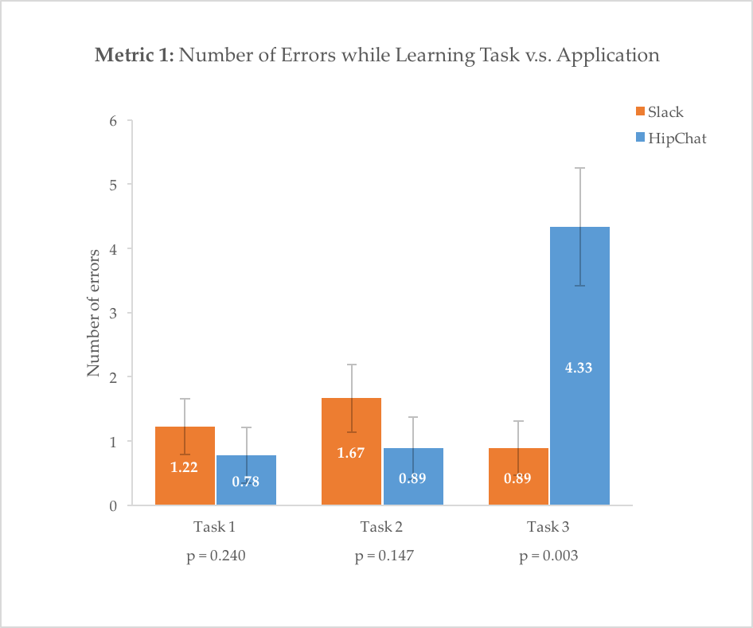

None of the differences in time to complete the tasks once having been learned are statistically significant.

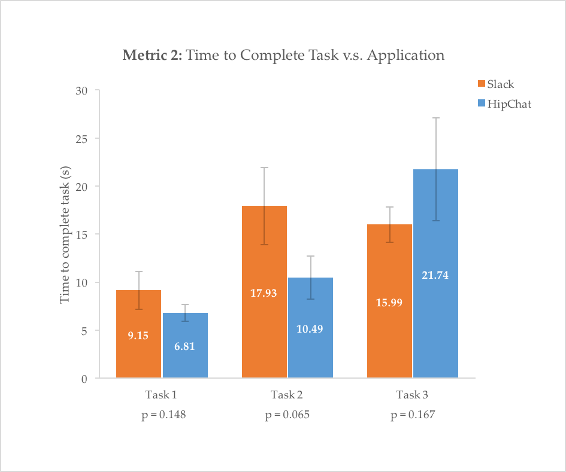

The difference in satisfaction between Slack and Hipchat is the least statistically significant out of all the measurements.

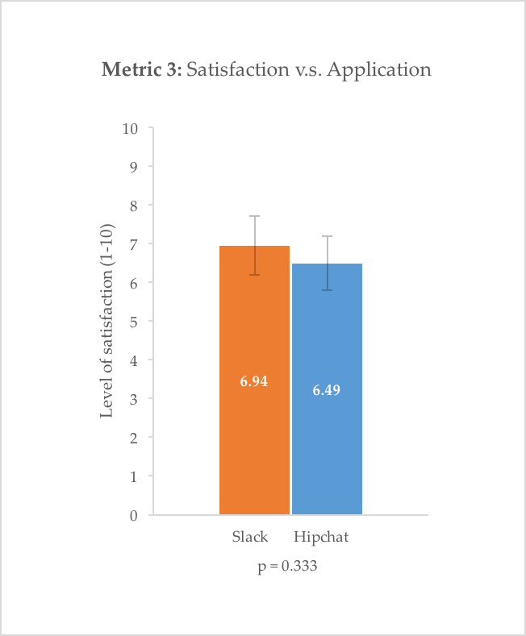

## Heuristic Evaluation

### Task 1: Create a New Channel/Group

#### Slack

Notice in the Slack interface that the button responsible for initiating the "Create Channel" dialog is rendered in a low intensity color, drawing attention away from the button. The relative invisibility of this particular signifier likely contributed to the lower learnability of Slack's channel creation function relative to Hipchat's. From the designer's perspective, the button's natural mapping in close proximity to the header for the "Channels" section makes perfect sense. The designers likely wanted to prioritize the visibility of active channels over the creation of new ones (accessing an existing channel would be a more commonly performed action), but ended up causing confusion among users.  

&nbsp;

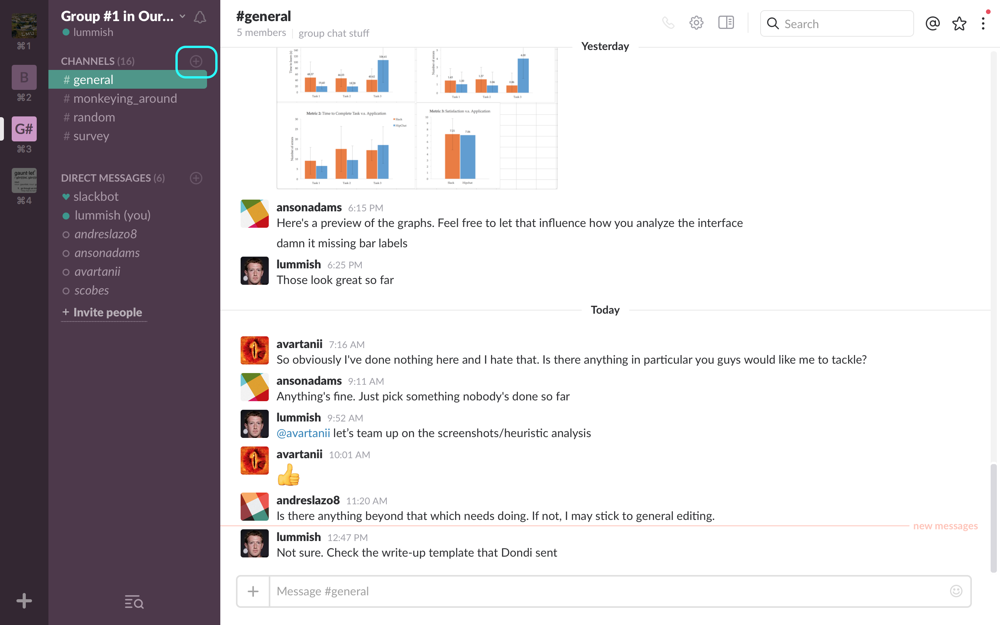
*Figure 1.1: Slack's Create Channel button, highlighted in blue.*

&nbsp;

Another likely contributing factor to Slack's poor relative learnability in terms of channel creation would be the restrictions of certain characters in the names of Slack channels, highlighted in red in Figure 1.2. Many users made the error of including forbidden characters, likely due to the low visibility of the requirement. These errors may be a result of differing utilities between Slack and HipChat, thus in later studies we would eliminate this variability by requiring users to enter a predetermined channel name that *included* underscores. The developers likely did not want to make the restrictions more prominent to avoid giving the user impression that they had done something improper when no such activity had yet occured. 

&nbsp;

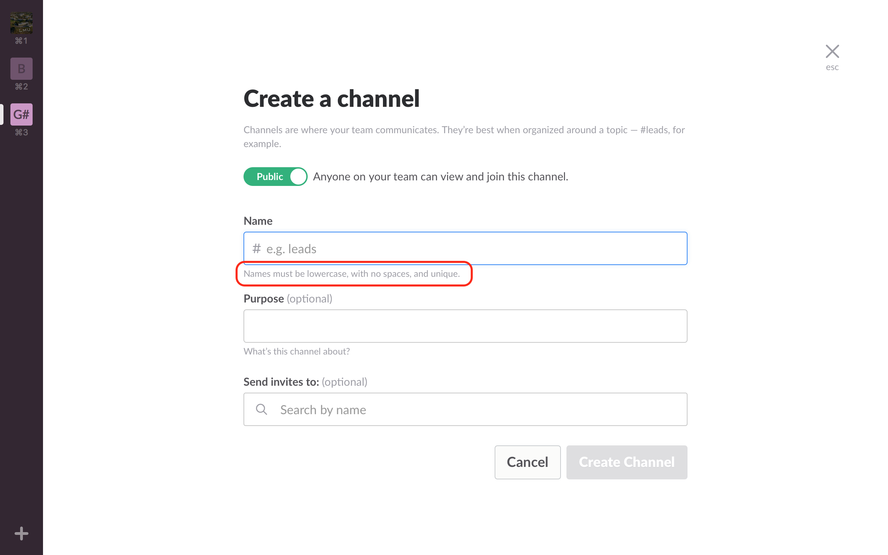
*Figure 1.2: Slack's create channel dialog, with nomenclature requirements highlighted in blue*

&nbsp;

Figures 1.3 and 1.4 demonstrate two different error dialogs for improper channel names. Slack provides incomplete feedback regarding the requirements of the channel name. If a user enters a channel name with spaces, they will not be notified that uppercase characters are also forbidden and vice-versa. Notice how in the second pictured error that the user made two separate errors by including both uppercase characters and spaces, but would only be notified of the first error they made. The developers likely wanted to make error messages as concise as possible, but in doing so reduced the usefulness of the feedback provided to the user

&nbsp;

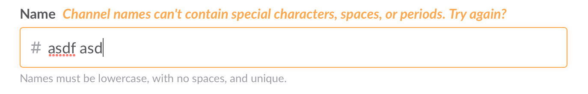
*Figure 1.3: Error message for channel name containing space characters*

&nbsp;

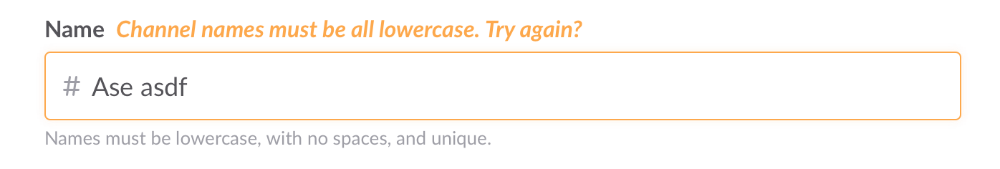
*Figure 1.4: Error message for channel name containing space and uppercase characters*
 
&nbsp;

****

&nbsp;

#### HipChat

HipChat displays two prominent buttons which users may interpret as signifiers of the "Create Room" action. One of these is located in the upper left of the interface (see the button outlined in red in Figure 1.5). This button opens a dialog (pictured in Figure 1.6) wherein the user can start a chat with an existing teammate or within an existing room. A number of users confused this button for the actual "Create Room" button (outlined in blue in Figure 1.5), and still attempted to create a chat from within this dialog. The "New Chat" functionality would be useful to a more experienced user, but its name confuses newer users and its associated dialog provides little useful feedback in terms of misusing the function. Though the mapping and visual prominence of the "Create Room" button made it relatively easy for users to find it, there was still much confusion between this button and the "New Chat" button. 

&nbsp;

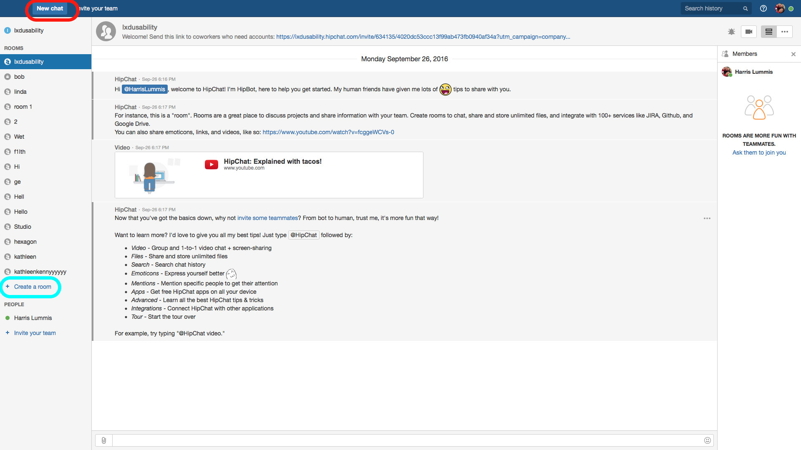
*Figure 1.5: Hipchat's "Create Room" and "New Chat" buttons, highlighted in light blue and red respectively*

&nbsp;

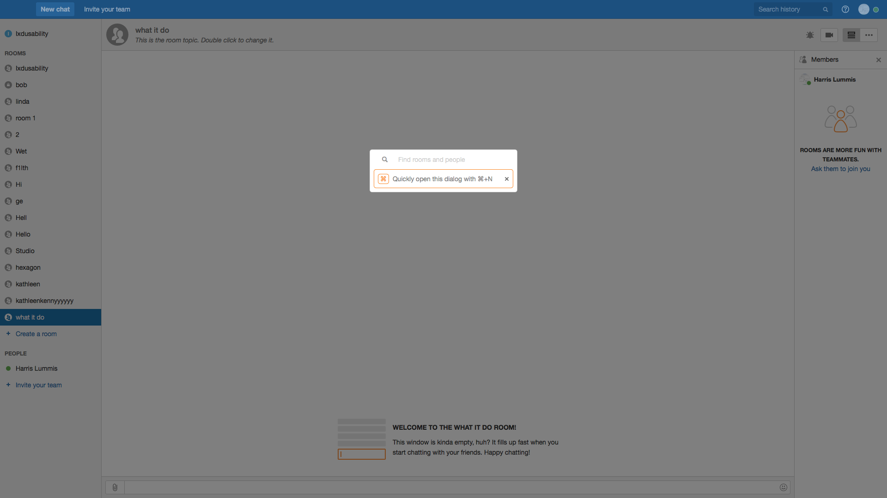
*Figure 1.6: HipChat's "New Chat" dialog*

&nbsp;

HipChat allows for the creation of groups whose names include space and uppercase characters, and has a similar dialog to that of Slack. Nothing notable here.

&nbsp;

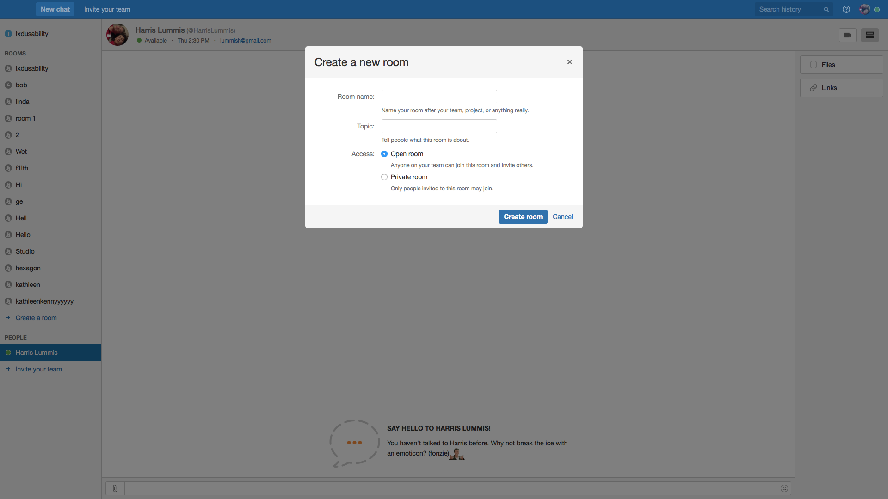
*Figure 1.7: HipChat's "New Room" dialog*

&nbsp;

### Task 2: Invite Teammates By Email

Before delving into the specifics of either app, it is important to take note of the fact that both apps have the capability to create an overarching chat space (named Team in Slack and HipChat, but referred to as a ‘chat’ in HipChat and a ‘group’ in Slack in certain instances) and chat threads within the larger space (channels in Slack, rooms in HipChat). This means that at the time of inviting people to the larger chat space or the individual threads, a user must be able to identify how to accomplish these separate tasks. Failure to distinguish the two was the main cause for errors and delays in the learnability stage of this task.

#### Slack

The two options for inviting people to the larger team and to a specific channel are shown in Figure 2.1 and Figure 2.2 respectively. 

The task given to testers was to invite people to the team, so Figure 2.1 displays the correct option needed to accomplish this task. The button is prominently displayed under the list of people currently participating in the larger team; an intuitive location that works as a signifier in itself, as a user is likely to look at the list of members when considering inviting more. Moreover, the button is both larger and contrasts more heavily with the background than the buttons above it, making it easier. 

The button in Figure 2.2, however, will prompt the user to select from a list of usernames to invite an already established team member to join a channel. However, it should be noted that this option only appears at specific moments where it might be needed, such as when a channel other than the main #general channel is chosen, and is largely absent at other times. However, it being rather small and colored in a light shade of blue behind a white backdrop, it is possible for users to miss it or to gloss over the text and fail to recognize its use.

&nbsp;

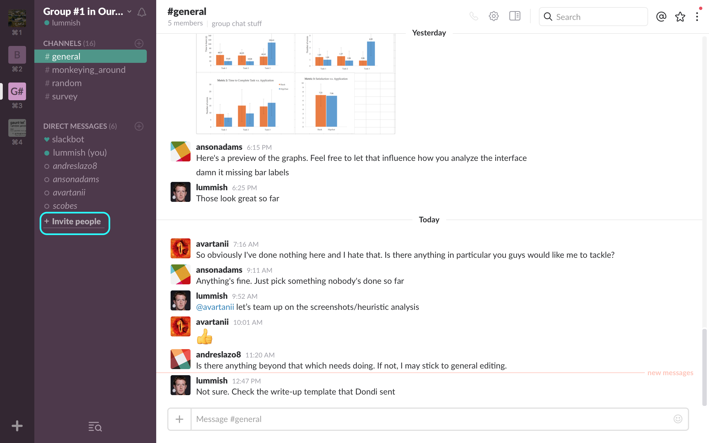
*Figure 2.1: Slack’s invite people to group option, circled in blue.*

&nbsp;

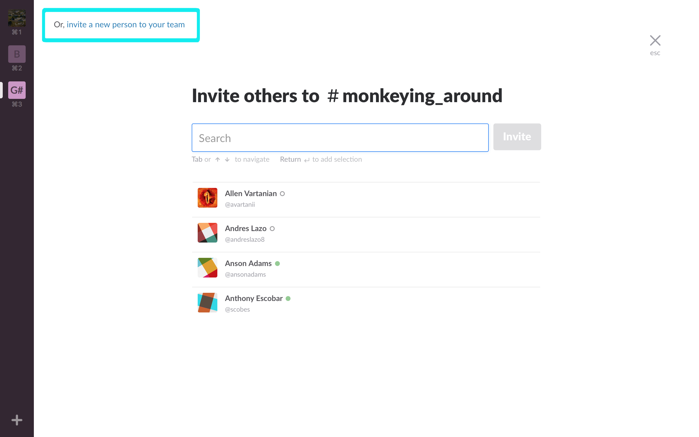
*Figure 2.2: Slacks’ invite people to channel option, circled in blue.*

&nbsp;

The main problem with both of these options is that their specific function is not explained through the text, and as such can be confusing to new users. Furthermore, as one may notice from Figure 2.2, the text used for the ‘invite people to channel’ dialog seems to indicate that its purpose is to invite people to the team itself. This is not the case, and resulted in errors for some of the testers. 

While Slack requires its users to remember their specific uses, an experienced user is likely to know the proper use of either button. The selection is only made easier by the fact that the option to invite people to a specific channel only appears when the user may want to do so, and does not appear otherwise.

&nbsp;

****

&nbsp;

#### HipChat

Figure 2.3 illustrates the options that result in one inviting a new team member to the chat (blue), or inviting an established team member to a group (red).

As with Slack, HipChat displays the option to invite new team members under the list of current members, thus mapping the button to an intuitive location and highlighting it so that it might be distinguished from other items in its vicinity. Moreover, as though anticipating problems finding this button, another button with the same function can be found in the top left. This likely influenced the lower times in the learnability and efficiency tests for HipChat, as finding the option to invite new teammates becomes easier when it is not bound to a single location in the screen, and experienced users may be able to reach a button faster than if it was located at a single, specific location.

Problems arise when one considers the large button with an attention-grabbing image atop of it on the far left of the screen. The tab this button is on can always be present on the screen, and shows the users currently part of a specific chat room. While the other two buttons allow you to invite new members, this is the button that invites established members to a different chat room.   

&nbsp;

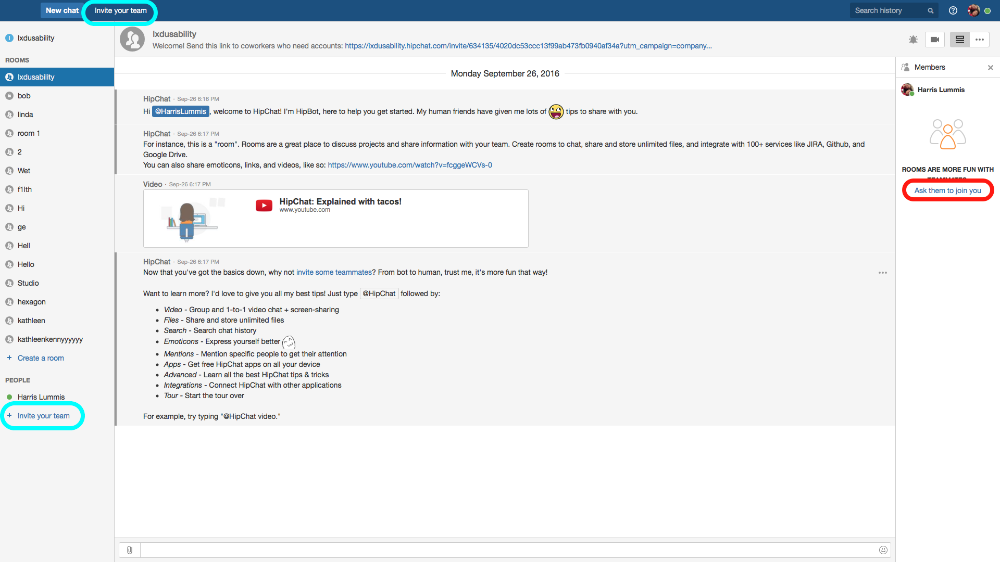
*Figure 2.3: HipChat’s invite to team option, circled in blue, and invite to room option, circled in red.*

&nbsp;

*Figure 2.4: HipChat’s invite to team dialog. Note that it prompts for email addresses.*

&nbsp;

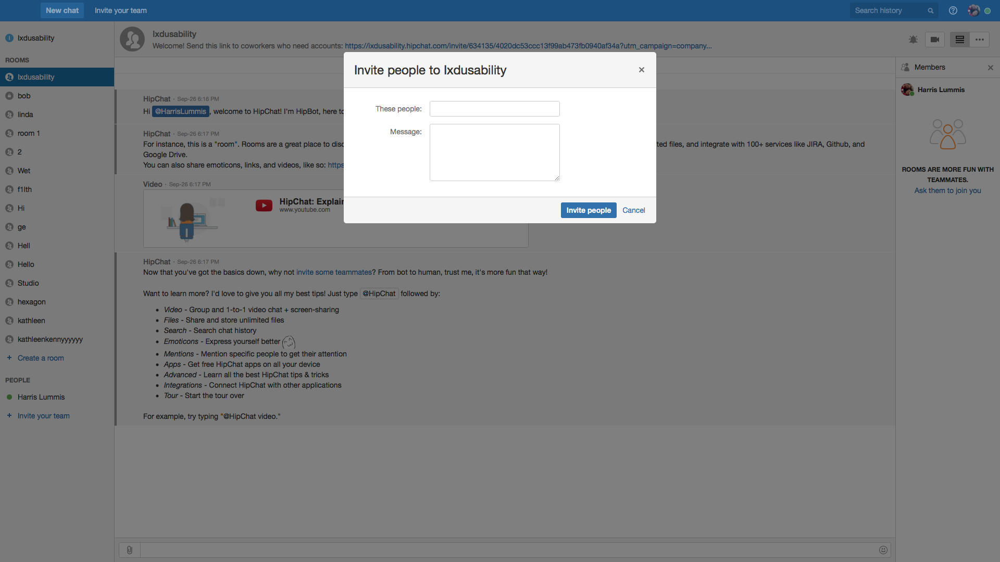
*Figure 2.5: Hipchat’s invite to group dialog. Note it that prompts for usernames.*

&nbsp;

As shown in Figure 2.4 and Figure 2.5, pressing the buttons on the left of the interface allow one to input an email address to invite a new member, and pressing the button to the right allow one to invite a team member to the currently selected room.

Once more, this was a source of confusion amongst the testers taking a part in the learnability study. That said, while both options tend to be present on the screen at the same time, the text on each is such that a user with the knowledge to differentiate a team from a room may deduce the correct one even as a first-time user. The problem with this is that it takes longer than if the correct option was immediately intuitive, but it is unlikely to affect an experienced user.

In the case of an experienced user, an interface where both options are present at once may facilitate performing tasks. 

### Task 3: Change Profile Picture

#### Slack

Changing a user's profile photo was consistently easier to learn for new users in Slack relative to HipChat; only one user took an extraordinary amount of time to complete the task. This is due to Slack's editing options being logically mapped to the profile photo itself and there being a lower number of actions required of the user relative to HipChat.

Experienced users were able to complete the task marginally faster than the new users beause the experienced users did not need to hunt for the profile options as they already knew the method to access it. Slack gives plenty of opprotunity for a new user to find his or her account settings: as shown in Figure 3.1, each profile image or name will bring up profile options. By clicking on a user's own name, an option to edit his/her profile beomes available, as shown in Figure 3.1.

&nbsp;

*Figure 3.1: Slack's profile specific options are accessible via any profile name or photo.*

&nbsp;

Profile editing is laid out front and center, in large font with examples in the text fields to make it clearer to newer users what options they have and what content is expected in each text box. 

The option to change one's proflie photo is by far the most prominent clickable object in play on this page, making its intentions clear to a new user and acting as a viable signifier. As seen in Figure 3.3, once the profile photo is clicked, a dropdown menu opens giving the user options to upload and image or remove the current photo. These options being colored coded keeps the user from making the error of clicking remove photo due to its being red. 

&nbsp;

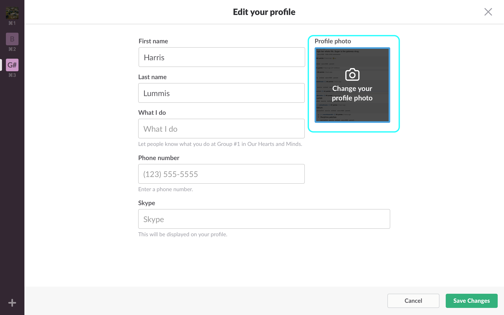
*Figure 3.2: Slack makes the profile editing very obvious.*
&nbsp;

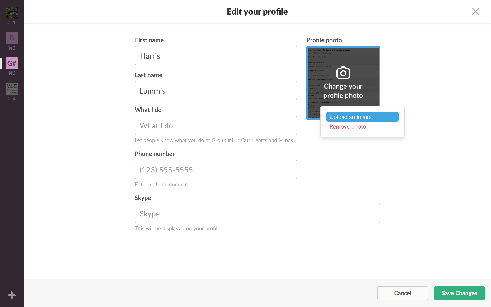
*Figure 3.3: Slack provides a dropdown menu to access the profile photo editing options.*

&nbsp;

Clicking the "Upload an image" option brings up a file browser to select an image.

&nbsp;

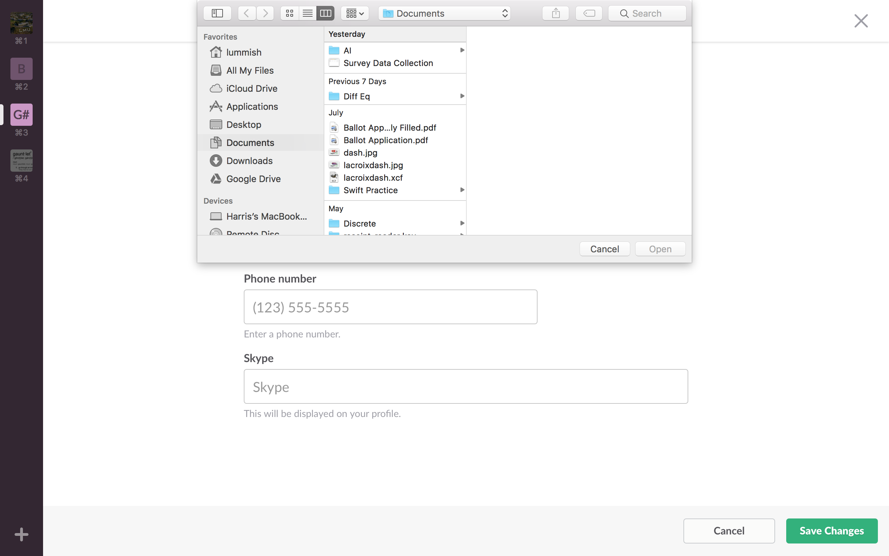
*Figure 3.4: Generic iOS file browser used for previewing and picking the desired image.*

&nbsp;

The "Save Profile Photo" and "Cancel" buttons are easily distinguishable between one another with the "Save" button being a bringht green. The vibrance of the color is a signifier to the user that this is the proper button to click. This leaves less room for mistake by the user.

&nbsp;

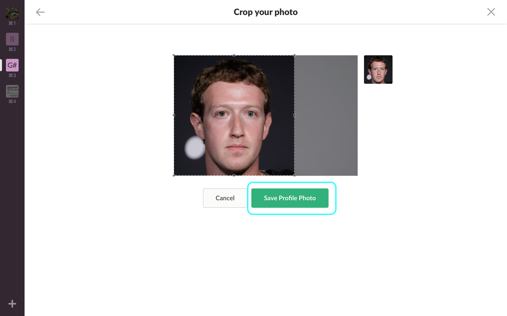
*Figure 3.5: Slack highlights the 'Save Profile Photo' button in green to attract the eyes of the user.*

&nbsp;

****

&nbsp;

#### HipChat

New HipChat users found themselves making numerous errors while attempting to complete this task. Many errors were made when attempting to locate the account settings. Possibly due to HipChat's only having one location to access these settings, users spent more time searching for an action that would allow them to accomplish their task. HipChat provides account settings at the top right corner of the screen, signified by the user's profile image (see Figure 3.6), however this signifier is small and thusly easy for a new user to miss. Some of the users resorted to clicking through many different and incorrect settings menus in order to find an alternate route to find the account settings. Had HipChat implemented a more comprehensive and informative nomenclature within their menus, or perhaps included multiple methods by which users can access their profiles, users would have been less likely to assume that certain menus would take them to their profile settings page.

&nbsp;

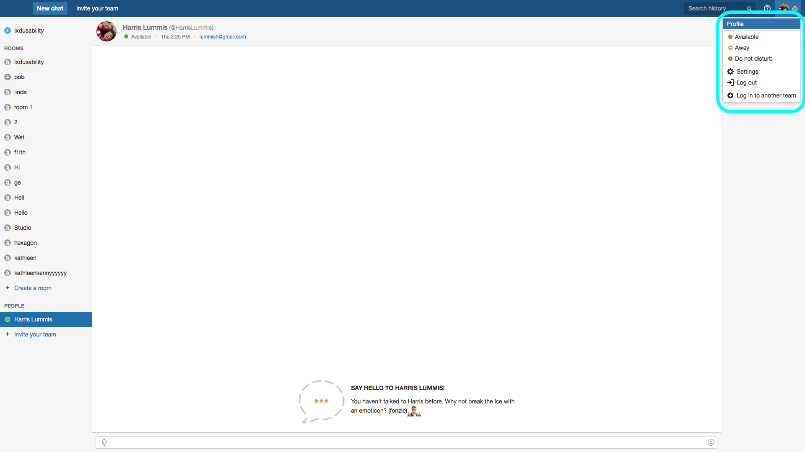
*Figure 3.6: HipChat tucks away the profile options in a dropdown acessible from the top right of the screen.*

&nbsp;

The profile image signifier was clear to new users. The blue attracts the user's attention easily so he or she can complete the task of changing his or her profile photo, but after this step, users underwent a great deal of trouble attempting to change their profile photo. As seen in Figure 3.8, once the users trigger the change photo action, two more options become available, "Choose File" and "Upload New Photo". Several users made errors by clicking "Upload new photo" when no file was chosen. In addition, some users neglected to finalize the change by triggering the upload action and would skip to the "Save" button, which would delete the selected photo from the webpage.

&nbsp;

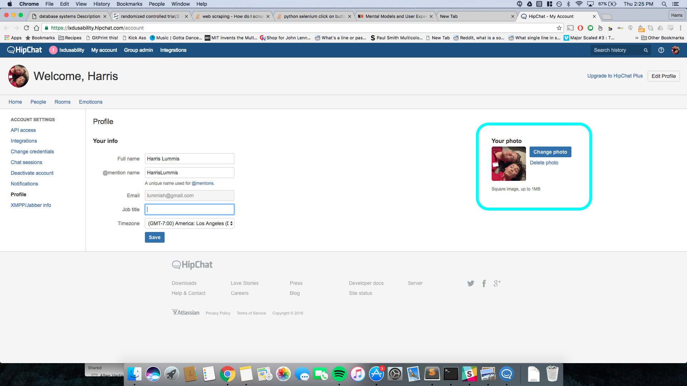
*Figure 3.7: HipChat provides a change photo option in blue to contrast the white backround.*

&nbsp;

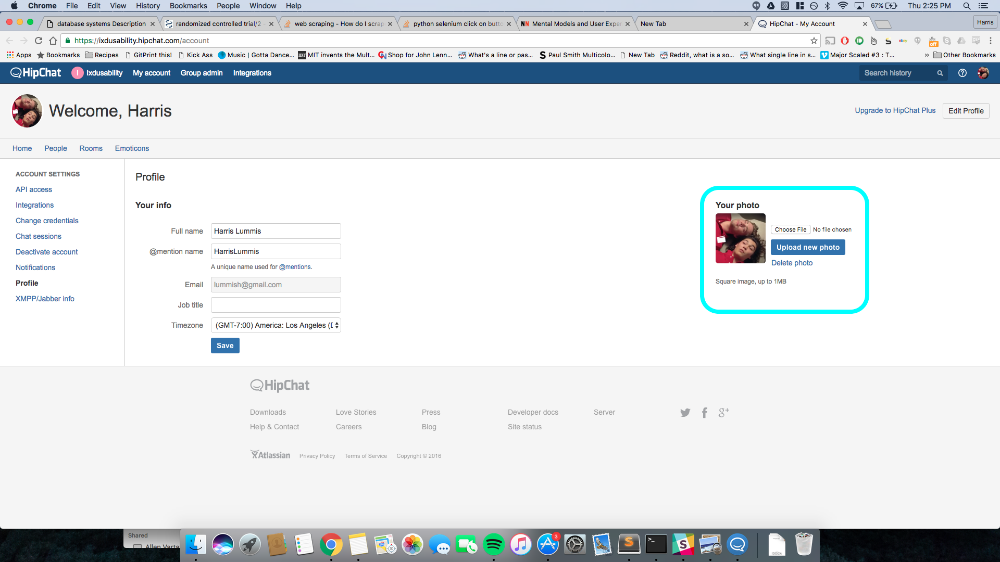
*Figure 3.8: Once clicked, the upload photo options become available.*

&nbsp;

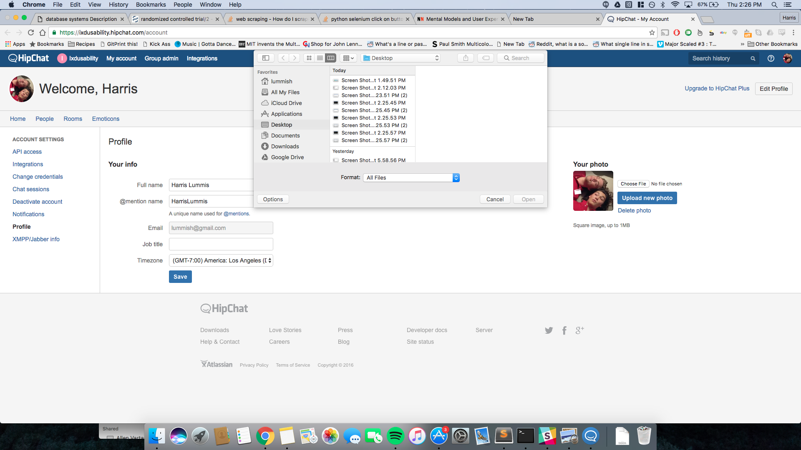
*Figure 3.9: Generic iOS file browser used for previewing and picking the desired image*

&nbsp;

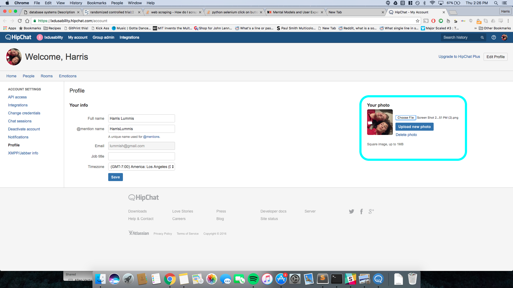
*Figure 3.10: HipChat needs the user to click 'Upload new photo' in order to change the photo.*

&nbsp;

Experienced users, however, did not experience these issues once figuring out how HipChat's organzational structure works. Some, even after their errors the first time around, noted that they preferred HipChat's method due to it being similar to Facebook's method of changing a profile photo.

### Prioritization of Metrics

Because both applications are primarily geared towards professional environments, users will probably be using them fairly often, so we ranked efficiency as the first priority in determining relative usability. For the same reason, we would designate satisfaction as the second priority; no one wants to use a system that they hate on a daily basis. Learnability is less important because neither system is particularly tricky to learn and once a user has completed a task for the first time and neither piece of software is particularly complicated in relation to other professional software.

### Usability Decision

#### Comments from users.

"It's weird that it opens up on the browser" (HC, choosing to edit the profile)
"I prefer changing profile picture in HC because it's similar to facebook."
"I don't like how they tried to mix facebook and AOL (HC interface)"

From a purely statistical perspective, the only significant difference in the usability of Slack and HipChat (at least in regards to the tasks that we assessed) was that changing one's profile picture in Slack was learned much more quickly by most users. Satisfaction is a difficult measure to assess statistically due to its subjective nature; some people who *hated* a certain app gave it a rating of 4/10, while others who hated it may have given it a lower rating. However, based on the strongly-worded negative comments from some of our users during their experience with HipChat (e.g. "HipChat sucks!"), we have decided to bestow Slack with the title of "More Usable."

### Statement of Work

#### Harris
Took screenshots, did several surveys with Allen and Anthony, some by himself. Also responsible for analysis of Task 1 and edited Task 3 analysis. Wrote Usability Decision and Prioritization summary. Defined some division of labor for project.

#### Allen
Did surveys with Anthony and Harris, head editor for all Tasks.

#### Andres
Did surveys on own, in charge of Task 2 analysis, kept us all in check. 

#### Anthony
Did surveys with Allen and Harris, in charge of Task 3 analysis. 

#### Anson
Responsible for entire statistical analysis (made original Excel sheet, created graphs and wrote full statistical analysis).
